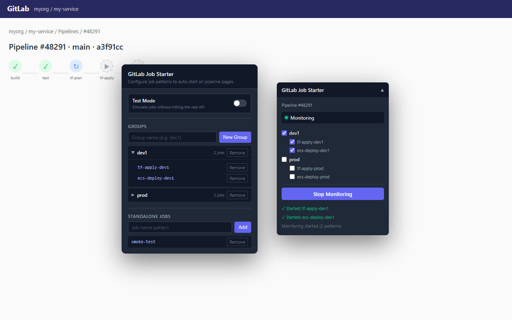

# GitLab Job Starter

Chrome extension that automatically triggers matching **manual** CI jobs on GitLab pipeline
pages. You configure a set of job-name patterns; when you open a pipeline page, the extension
polls the pipeline, finds manual jobs whose names match your patterns, and plays them for you —
using your existing GitLab session, on any GitLab instance (gitlab.com or self-hosted).



## What it's for

- Kicking off the same set of manual jobs every time you push, without clicking each "play"
  button by hand.
- Working across many repos / pipelines with one shared, syncable set of patterns.
- Self-hosted and gitlab.com alike — the extension targets whatever GitLab origin you're on.

It is **not** a CI configuration tool. It does not edit `.gitlab-ci.yml` or change pipeline
definitions; it only clicks "play" on manual jobs that already exist, on your behalf.

## Install

Until the extension is published to the Chrome Web Store — download the latest
`GitLabJobStarter-<version>.zip` from [Releases](../../releases), unzip, then in Chrome:

1. Visit `chrome://extensions`
2. Enable Developer Mode (top right)
3. Click "Load unpacked"
4. Select the unzipped `GitLabJobStarter/` folder (or the `.output/chrome-mv3` folder produced by `npm run build`)

Pin the toolbar icon to open the popup and configure your patterns.

## Usage

1. Open the extension popup from the toolbar.
2. Add **job-name patterns**. Each pattern has a string and a match type:
   - `contains` — the job name contains the string
   - `starts` — the job name starts with the string
   - `ends` — the job name ends with the string
   - `exact` — the job name equals the string exactly
3. Optionally organise patterns into named **groups** so you can manage related jobs together.
   Standalone (ungrouped) patterns are also supported.
4. Export your configuration as a string to share it, or import one from a teammate, via the
   Import / Export section.
5. Navigate to any GitLab pipeline page (a URL matching `…/-/pipelines/…`). An in-page widget
   appears. Press **Start** to begin monitoring: the extension polls the pipeline every few
   seconds and plays any manual job that matches an enabled pattern and hasn't already been
   started this session. The widget logs each job it starts.

The widget also tracks GitLab's SPA navigation — switching to a different pipeline stops the
current monitoring loop so jobs from the old pipeline aren't re-triggered.

## Concepts

### Patterns and groups

A pattern is `{ pattern, matchType }`. The watchlist is the set of standalone patterns plus
named groups of patterns. Matching unions across all enabled patterns, so a job is started if
it matches *any* of them (it is never started twice in a session).

### Manual-only

The extension only ever plays jobs whose GitLab status is `manual`. Jobs that are already
running, succeeded, or are not manual are ignored. It enumerates jobs from both the pipeline
itself and any started downstream (bridge) pipelines.

### Storage

Patterns and groups persist via `chrome.storage.sync`, so they follow your Chrome profile
across devices. Nothing else is stored, and no data is sent anywhere except the GitLab instance
you are actively using.

## Permissions

The extension requests:

- `storage` — persist your job-name patterns and groups across sessions (synced to your own
  Chrome profile)
- Host access to `*://*/*` — inject the content-script widget on GitLab pipeline pages and call
  the GitLab REST + job-play APIs **on the same origin you are currently browsing**. This
  breadth is inherent: GitLab can be self-hosted on any domain, so the extension cannot ship a
  fixed domain allowlist without breaking self-hosted users. The content script only *activates*
  on URLs matching `*://*/*/-/pipelines/*`.

The extension talks only to the GitLab instance you are logged into and viewing. It does not
store credentials, read cookies/passwords/history, or transmit any data to the author or any
third party.

See `docs/permissions-justification.md` for the per-permission Web Store narrative and
`docs/privacy.html` for the privacy policy.

## Development

Requires Node 22+ and **npm 11.10 or newer** — the repo's `.npmrc` uses
[`min-release-age`](https://docs.npmjs.com/cli/v11/using-npm/config#min-release-age) (and other
supply-chain hardening defaults) which silently no-ops on older npm. If you're on the npm that
ships with Node 22 (10.x), upgrade with `npm install -g npm@latest`.

```bash
npm install
npm run icons       # generate icon PNGs from src/icons/icon.svg
npm run dev         # WXT dev server (HMR)
npm run build       # production build → .output/chrome-mv3
npm run typecheck   # tsc over src/ and the test project
npm run lint        # prettier --check over src/ and tests/
npm test            # vitest unit tests
npm run zip         # build + zip → .output/<name>-<version>-chrome.zip
```

Load the built `.output/chrome-mv3` via `chrome://extensions` → "Load unpacked" while iterating.
Releases are cut by CI on tag push (`.github/workflows/release.yml`), which publishes both the flat
Web Store zip and a folder-wrapped `GitLabJobStarter/` zip for unpacked installs.

### Supply-chain hardening

The committed `.npmrc` blocks lifecycle scripts (`ignore-scripts=true`), refuses package
versions published within the last 3 days (`min-release-age=3`), pins the registry, and writes
any newly-installed package to `package.json` as an exact version (`save-exact=true`). The
committed lockfile pins the full dependency tree and is the primary line of defense. If a fresh
`npm install` needs to rebuild a
native dependency (e.g. `@resvg/resvg-js` on an unsupported platform), run
`npm rebuild <package>` explicitly — the lifecycle-script block is the primary execution vector
for compromised packages, so the rebuild is opt-in.

### Project structure

```
wxt.config.ts              WXT config — generates the MV3 manifest (permissions, content scripts, action popup)
src/
  entrypoints/
    background.ts          minimal MV3 service worker (the content script owns polling)
    gitlab.content.ts      pipeline-page content script (*/-/pipelines/*); builds the in-page
                           widget via createShadowRootUi (Shadow DOM)
    popup/                 Preact popup UI for configuring patterns/groups
      App.tsx, components/, hooks/, index.html, popup.css
  content/
    csrfToken.ts           reads the page's CSRF <meta> token
    widget.css             widget styles (emitted as content-scripts/gitlab.css via cssInjectionMode:'ui')
  shared/
    gitlabApi.ts           GitLab REST calls + job-play (URL construction, pagination)
    patterns.ts            pure pattern-matching logic
    storage.ts             typed chrome.storage.sync wrapper + legacy migration
    constants.ts
  types/                   GitLab API + storage type definitions
scripts/                   icon generation (generate-icons.mjs)
tests/unit/                vitest unit tests for the pure-logic modules
docs/                      privacy.html, permissions-justification.md, screenshots
```

### Architecture

A content script is injected at `document_idle` on pages matching `*/-/pipelines/*`. It parses
the origin, repo path, and pipeline id from the URL, then runs a polling loop on an interval:
it calls the GitLab REST API for the pipeline's manual jobs (following `Link` pagination and
including any started downstream bridge pipelines), matches them against the user's enabled
patterns, and POSTs to the `/-/jobs/:id/play.json` endpoint for each match — authenticated with
the page's CSRF token and the user's session cookie. Already-started job ids are tracked
in-session to avoid re-triggering.

The popup is a small Preact app that reads/writes the watchlist via `chrome.storage.sync`; the
content-script widget listens for `storage.onChanged` so edits in the popup take effect without
a reload. The MV3 service worker is intentionally minimal — all logic lives in the content
script.

## Testing

Unit tests (vitest, `happy-dom` environment) cover the pure-logic modules: pattern matching,
CSRF-token reading, GitLab API URL construction / pagination / manual-job filtering, and the
storage migration. Run `npm test`.

There is no Playwright e2e suite. Driving the content script end-to-end requires a live
authenticated GitLab instance with a pipeline containing manual jobs, which isn't reproducible
in CI without significant fixture infrastructure; the valuable, deterministic logic is covered
by the unit tests instead.

## Contributing

- Branch off `main`. Open a PR.
- Keep commits small and focused.
- Run the test bar before pushing: `npm run typecheck && npm run lint && npm test && npm run build`
  (the `pre-push` hook runs the first three automatically).
- New code paths should have at least one test.

## License

MIT — see [LICENSE](LICENSE).
